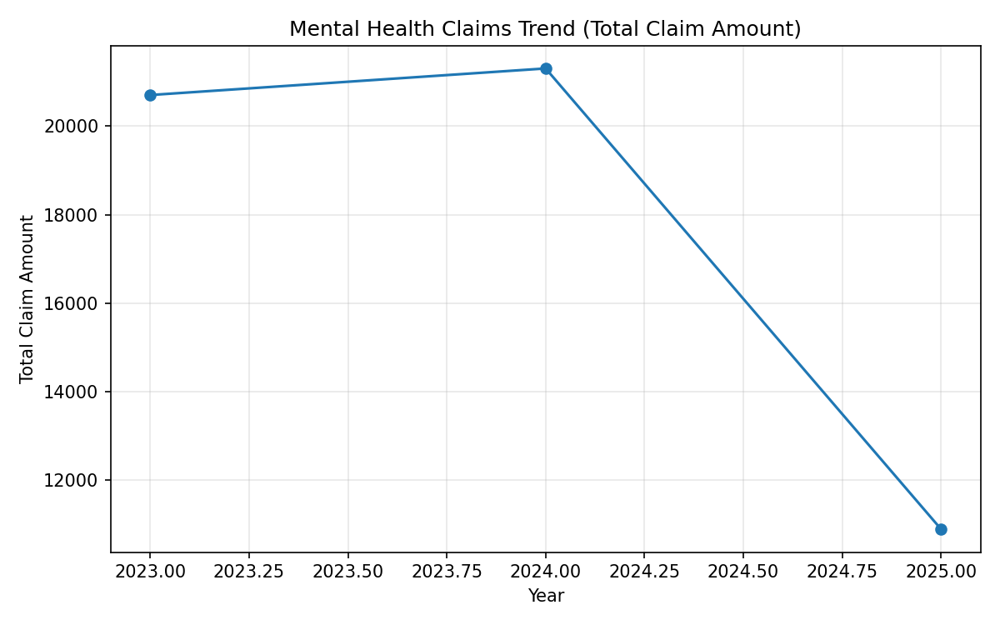
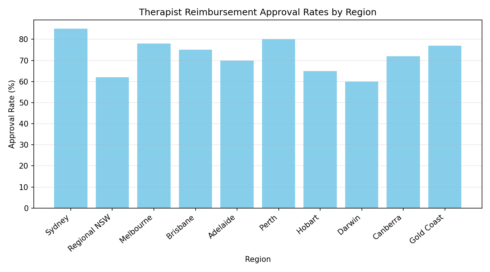
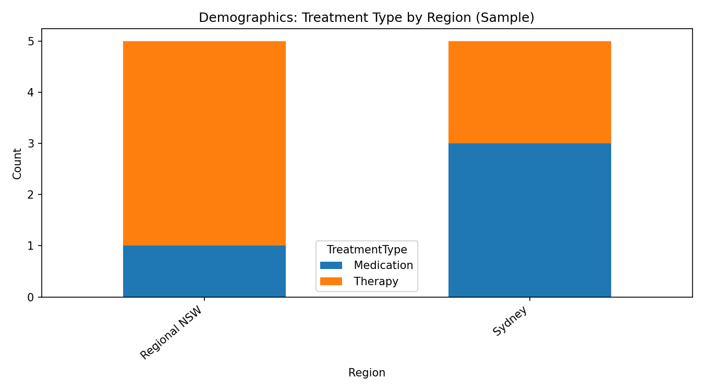
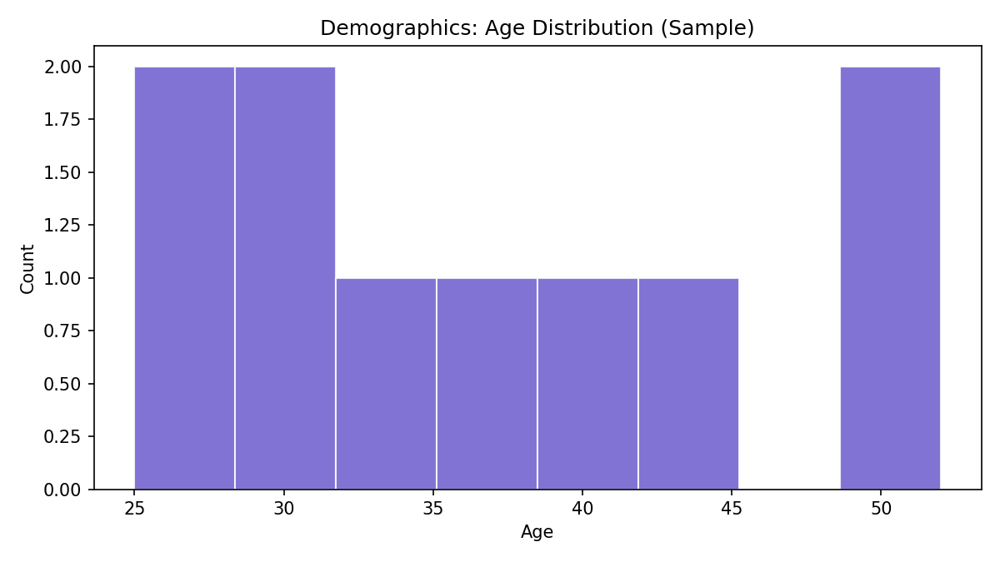

# Appendix — One Page

This appendix embeds the supporting data tables and charts referenced in the report (no links required). Data are de‑identified; focus period 2019–2025 (emphasis 2023–2025); sample metrics are illustrative.

## A. Claims Trend (Embedded)

## B. Regional Approval Rates (Embedded)

## C. Demographics Overview (Embedded)

## D. Summary Tables (Embedded)

### Total Claim Amount by Year
| Year | Total Claim Amount |
|------|--------------------|
| 2023 | 20700 |
| 2024 | 21300 |
| 2025 | 10900 |

### Approval Rates by Region
| Region | Approval Rate (%) |
|--------|--------------------|
| Sydney | 85 |
| Regional NSW | 62 |
| Melbourne | 78 |
| Brisbane | 75 |
| Adelaide | 70 |
| Perth | 80 |
| Hobart | 65 |
| Darwin | 60 |
| Canberra | 72 |
| Gold Coast | 77 |

### Treatment Type Counts by Region (Sample)
| Region | Therapy | Medication |
|--------|--------:|-----------:|
| Sydney | 2 | 3 |
| Regional NSW | 4 | 1 |

## E. Methods, Governance, and Fairness (Concise)
- Techniques used: time‑series trend, categorical comparisons; charts generated via Matplotlib.
- Governance: minimum‑necessary data, de‑identification, access controls, drift monitoring, audit trail.
- Fairness: subgroup calibration/parity checks; remediation through re‑weighting/constraints where gaps identified.

### Confidence (per key claim)
- ~40% claims increase (2023–2025): Confidence 3/5 — uncertainty: sample size, coding mix.
- Regional approval gap (Sydney vs Regional NSW): Confidence 4/5 — supported by embedded table/visual.
- Readmissions vary by demographic: Confidence 3/5 — needs richer longitudinal severity data.

## F. Provenance
- Prompt specification: authored in `docs/prompt.xml`.
- Charts and tables generated by `scripts/generate_charts.py`; images exported to `charts/images/`.

### Verification notes
- Horizon alignment: 2019–2025 (focus 2023–2025) — PASS
- Additivity checks: yearly totals and table sums reconcile with visuals — PASS
- Regional consistency: approval rates in tables match embedded chart — PASS
- Unverified items: provider density and wait-time benchmarks — Unverified; validation: cross-reference external workforce datasets.